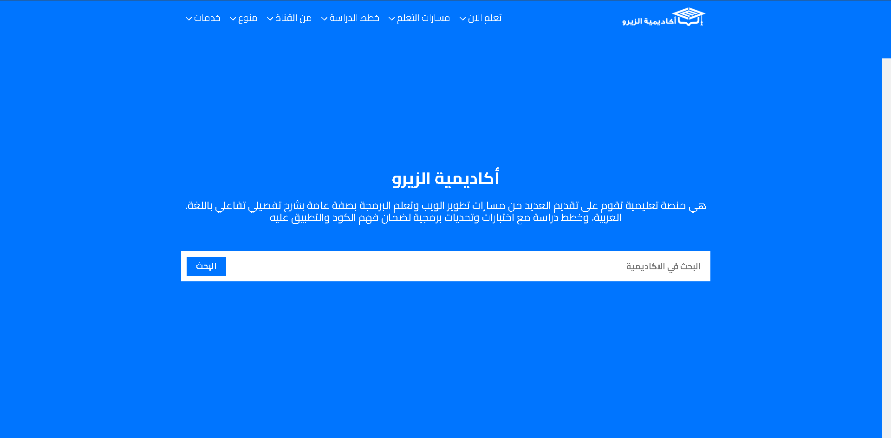

# Elzero Website Clone

This project is a clone of the **Elzero Academy** website, aimed at recreating its design and functionality as closely as possible. It serves as a personal project for practicing front-end development skills and replicating real-world website structures.



---

## About the Project

The Elzero website clone is built to match the look and feel of [Elzero](https://elzero.org/)—a popular platform for web development tutorials, coding resources, and courses. The site has been recreated to better understand HTML, CSS, and JavaScript principles and improve website-building skills.

---

## Features

- **Responsive Design**: Optimized for desktop, tablet, and mobile views.
- **Dynamic Content**: Interactive elements powered by JavaScript.
- **CSS Animations**: Smooth transitions and animations for better user experience.
- **Modular Structure**: Organized code with reusable components.
- **SEO Friendly**: Basic SEO optimizations for improved search visibility.

---

## Technologies Used

- **HTML5**
- **CSS3**
- **JavaScript**
- **Font Awesome** (for icons)
- **Google Fonts** (for typography)

---

## Installation

To get a local copy up and running, follow these steps:

1. Clone the repository:
   ```bash
   git clone https://github.com/ifhadii/elzero-academy-clone.git
